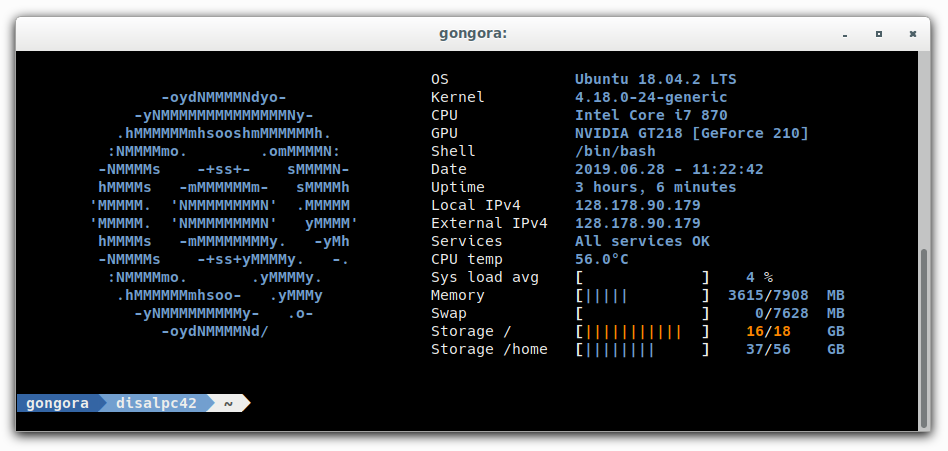
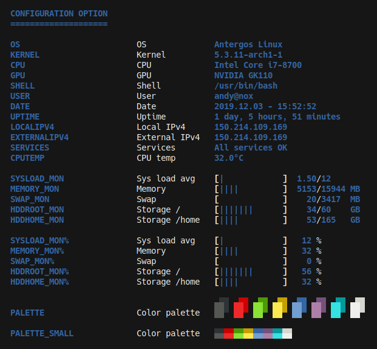

**synth-shell** improves your terminal experience and productivity by adding color, extra info, and
convenience. It is not a single tool, but a collection of scripts and aliases (feel free to install
only those you want) all written in bash. See the [overview section](#overview) for a detailed list
and options.

<br/><br/>
<!------------------------------------------------+------------------------------------------------>
##                                            Quick setup
<!------------------------------------------------+------------------------------------------------>

This section covers the vary basics if you want to get started as fast as possible. See the
[setup section](#setup) of this file for more details. Also, before you get started, and to get the
best possible experience **there are important considerations**:

* **power-line fonts**: install package `powerline-fonts` on Arch or `fonts-powerline` on Ubuntu.

* **terminal font**: configure your terminal emulator to use a nice font. We recommend
[hack-ttf](https://sourcefoundry.org/hack/) which you can install for most distros under that name.

* **Remember that support for Windows is not guaranteed**. But feel free to fix any bug you
encounter and contribute to this project.

* **Clone this repository recursively** since there are git submodules in it (you only have to copy
paste the commands down below as they are).

Once everything is ready, it is as easy as copy-pasting the following commands to run the included
setup script.

```
git clone --recursive https://github.com/andresgongora/synth-shell.git
cd synth-shell
./setup.sh
```

When prompted, select **install** (default) and **user** (default). Afterwards, you might need to
open a new terminal. Afterwards, you can
[customize everything to your liking](#configurationcustomization).

<br/><br/>
<!------------------------------------------------+------------------------------------------------>
##                                             Overview
<!------------------------------------------------+------------------------------------------------>

The following tools and scripts are included in the **synth-shell** package:

- **System status report** (aka [synth-shell-greeter](https://github.com/andresgongora/synth-shell-greeter)):
  - Shows for every new terminal session (local, SSH, ...).
  - Monitor your servers, RaspberryPis, and workstations. All system info you need at a glance (e.g. external IP address, CPU temperature, etc.).
  - Detect broken services or CPU hogs by printing extra diagnostic data, but only when needed.
  - Print your own ASCII logo every time you log in or, if none specified, your distro's logo.

- **Fancy bash prompt** (aka [synth-shell-prompt](https://github.com/andresgongora/synth-shell-prompt)):
  - Configurable colors and aesthetics.
  - Git statuses (requires pull/push, is dirty, etc.) if inside a directory that is part of a git repository.
  - Better separation between user input and command outputs.

- **better ls**: an `ls -la` on steroids alternative.

- **alias**: add colors and a nicer behaviour to basic commands.
  - `grep`.
  - `pacman`.
  - `tree`.
  - `dmesg`.
  - `free`.
  - `sudo`: autocomplete commands.
  - `history`: nicer format and no duplicate (consecutively the same) commands.



All features are optional, and most can also be customized to your liking. Once installed, the
scripts are called from within you `.bashrc` file and become part of the bash session. Everything is
written in bash and should work out of the box on almost any Linux system (you might need to install
some dependencies, but that is all).

### status.sh
`status.sh` provides a summarized system report at a single glance every time you open up a new
terminal. If it detects that any system parameter (e.g. CPU load, memory, etc.) is over a critical
threshold, it will provide a warning and additional information about the cause. Last but not least,
it prints a user-configurable ASCII logo to impress your crush from the library with how awesome you
are.

Feel free to customize your status report through the many available options in
`~/.config/synth-shell/status.config` (user-only install) or `/etc/synth-shell/status.config`
(system-wide install),or by replacing their content with the examples files you can find under the
same directory.



### fancy-bash-prompt.sh
Adds colors and triangular separators to your bash prompt, and if the current working directory is
part of a git repository, also git statuses and branches. For best results, consider installing (and
telling your terminal to use) the `hack-ttf` font alongside the powerline-fonts (the later is
required for the separators).

As for the git status info, `fancy-bash-prompt.sh` prints an additional, fourth separator with the
name of the current branch and one of the following icons to indicate the state of the repository
(can be changed in the config file):

|          Local-Upstream          | Local branch has no changes | Local branch is dirty |
|:--------------------------------:|:---------------------------:|:---------------------:|
|            Up to date            |                             |           !           |
|     Ahead (you have to push)     |              △              |           ▲           |
|     Behind (you have to pull)    |              ▽              |           ▼           |
| Diverged (you have to pull-push) |              ○              |           ●           |

### better-ls.sh
Makes `ls` print more text, but nicely formatted. When called, `ls` will now list all files (`-la`),
sort folders first, add colors to output, and list hidden files last after a quick separator.
However, if you chose to call `ls` with your  own parameters (e.g. `ls -l`) it will revert to the
default behavior except for color and sorting options.

### Alias

- `grep` to `grep --color=auto`.
- `pacman` to `pacman --color=auto`.
- `tree` to `tree --dirsfirst -C`.
- `dmesg` to `dmesg --color=auto --reltime --human --nopager --decode`.
- `free` to `free -mht`.
- `sudo` adds `complete -cf sudo` to auto-complete commands.
- `history` various changes.

<br/><br/>
<!------------------------------------------------+------------------------------------------------>
##                                              Setup
<!------------------------------------------------+------------------------------------------------>

### Automatic setup

The included [setup script](setup.sh) will guide you step by step through the
process and let you choose what features to install. During this setup, you can
choose to install synth-shell for your user only (recommended) or system-wide
(superuser privileges required). To proceed,
[open and play this link in a separate tab](https://www.youtube.com/embed/MpN91wHAr1k)
and enter the following into your terminal:
```
git clone --recursive https://github.com/andresgongora/synth-shell.git
chmod +x synth-shell/setup.sh
cd synth-shell
./setup.sh
```

Note that for `fancy-bash-prompt.sh` you might also need
[power-line fonts](https://github.com/powerline/fonts). You can install it
as follows (the exact name of the package varies from distro to distro):

* ArchLinux: `sudo pacman -S powerline-fonts`
* Debian/Ubuntu: `sudo apt install fonts-powerline`

Finally, open up a new terminal and test that everything works. Sometimes,
despite power-line fonts being properly installed, the triangle separator
for `fancy-bash-prompt.sh` (if installed) might still not show. In this case,
make sure that your `locale` is set to UTF-8 by editing `/etc/locale.conf` file
(select your language but in UTF-8 format) and running `sudo locale-gen`.
[More info on locale](https://wiki.archlinux.org/index.php/locale).
Alternatively, try a different font in your terminal emulator. Some fonts
do not support special characters. We get the best results with
[hack-ttf](https://sourcefoundry.org/hack/).


### Configuration/customization
You can configure your scripts by modifying the corresponding configuration
files. You can find them, along the example configuration files, in the
following folders depending on how you installed **synth-shell**:

* Current-user only: `~/.config/synth-shell/`
* System wide: `/etc/synth-shell/`


### Uninstallation
1. Edit `~/.bashrc` and remove the lines referring to synth-shell, usually
at the bottom of the file. If you want to temporarily disable the script, you can
just comment them by placing `#` in front.
```
nano ~/.bashrc
```

2. Remove the folder containing the script, usually in your home folder under
`~/.config/synth-shell/`.
```
rm -r ~/.config/synth-shell/
```


<br/><br/>
<!------------------------------------------------+------------------------------------------------>
##                                            Contribute
<!------------------------------------------------+------------------------------------------------>

This project is only possible thanks to the effort and passion of many, 
including developers, testers, and of course, our beloved coffee machine.
You can find a detailed list of everyone involved in the development
in [AUTHORS.md](AUTHORS.md). Thanks to all of you!

If you like this project and want to contribute, you are most welcome to do so.


### Help us improve

* [Report a bug](https://github.com/andresgongora/synth-shell/issues/new/choose): 
  if you notice that something isn't working properly, tell us. We'll try to fix it ASAP.
* Suggest an idea you would like to see in the next release: send us
  and email or open an [issue](https://github.com/andresgongora/synth-shell/issues)!
* Become a developer: fork this repo and become an active developer!
  Take a look at the [issues](https://github.com/andresgongora/synth-shell/issues)
  for suggestions of where to start. Also, take a look at our
  [coding style](/doc/coding_style.md).
* Spread the word: telling your friends is the fastest way to get this code to
  the people who might enjoy it!


### Git branches

There are two branches in this repository:

* **master**: this is the main branch, and thus contains fully functional
  scripts. When you want to use the scripts as a _user_,
  this is the branch you want to clone or download.
* **develop**: this branch contains all the new features and most recent
  contributions. It is always _stable_, in the sense that you can use it
  without major inconveniences. 
  However, it's very prone to have undetected bugs and it might be subject to major
  unannounced changes. If you want to contribute, this is the branch 
  you should pull-request to.


<br/><br/>
<!------------------------------------------------+------------------------------------------------>
##                                               About
<!------------------------------------------------+------------------------------------------------>

**synth-shell** started as a loose collection of (very simple) bash scripts I
used for system maintenance. In the beginning, they were simple aids to make my
life easier, but as I progressively got the hang out of bash, I also wanted them
to print some nice output to the terminal.

This repository was quite different at the beginning. The content of most
scripts were loose snippets from third parties that were somehow smashed
together. They worked, but not exactly the way I wanted. So, over time I have
rewritten most scripts from scratch, removed fluff, and teamed up with
super-friendly and engaged [contributors](AUTHORS.md). The result is what you
see today. I admit it, it's nothing fancy. But it was real fun working on the
scripts.

And the name? That's quite easy. I spent most of my coding frenzy
listening to [SynthWave](https://en.wikipedia.org/wiki/Synthwave) to feel like
[Hackerman](https://www.youtube.com/watch?v=KEkrWRHCDQU).


<br/><br/>
<!------------------------------------------------+------------------------------------------------>
##                                             License
<!------------------------------------------------+------------------------------------------------>

Copyright (c) 2014-2021, Andres Gongora - www.andresgongora.com

* This software is released under a GPLv3 license.
  Read [license-GPLv3.txt](LICENSE),
  or if not present, <http://www.gnu.org/licenses/>.
* If you need a closed-source version of this software
  for commercial purposes, please contact the [authors](AUTHORS.md).

